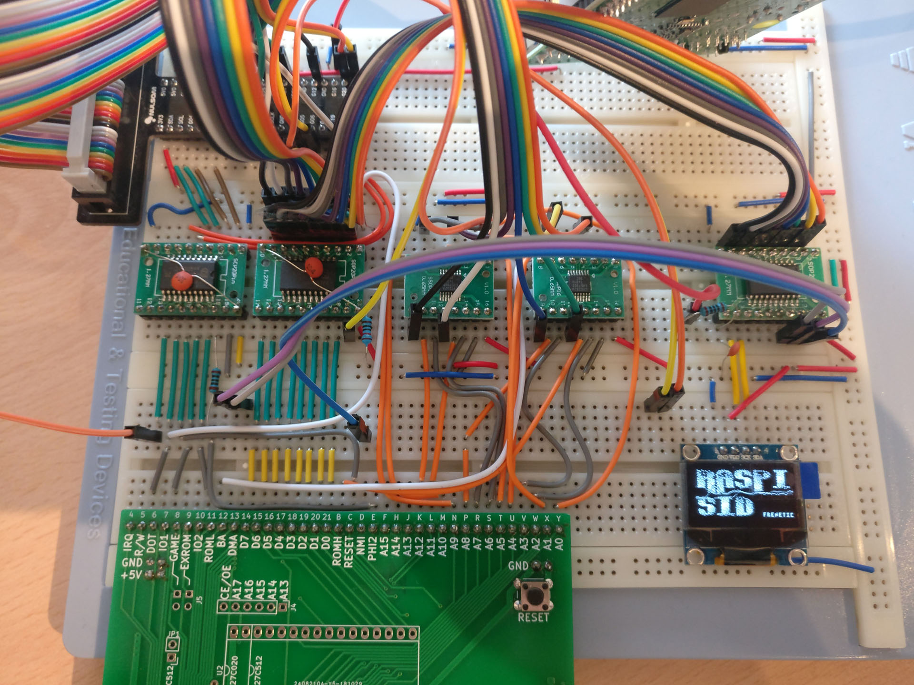

# Update

**This project has been superseeded by [Sidekick64](https://github.com/frntc/Sidekick64).**

Please follow this link, you'll find an update of RasPiC64 there.

# RasPIC64

RasPIC64 is a framework which enables a Raspberry Pi 3B/3B+ (RPi) to bidirectionally communicate on the bus of a Commodore 64. Example use cases of RasPIC64 are connecting the RPi to the expansion port where it can emulate a GeoRAM/NeoRAM-compatible memory expansion, a CBM80-cartridge, or run a Dual-SID plus FM emulation (the SID emulation would also work when connecting the RPi to the SID-socket on the board). But many more things are imaginable: emulating freezer cartridges, 80 column cards with HDMI video output, custom accelerators/coprocessors etc. 

Update: I added an emulation of Easyflash and Magic Desk cartridges, reading .CRT files from SD card.

# How does it work?

On the hardware side connecting the C64 to the RPi requires level shifting to interface the 5V bus with the 3.3V GPIOs of the RPi. However, things get a bit more complicated: communication on the data lines needs to be bidirectional, the RPi needs to get hands off the bus when it's not its turn. And even worse, the number of GPIOs of a standard RPi 3B/3B+ is too low to simply connect all signals to GPIOs! For the aforementioned use cases where we need to read address lines A0-A12, IO1, IO2, ROML, ROMH, Phi2, Reset, SID-chipselect, R/W and read/write data lines D0-D7 (plus GPIOs for controlling the circuitry). This makes the use of level shifters and multiplexers necessary. Optionally we would also need to set GAME, EXROM and RESET, and, very important :-), drive a tiny OLED display.

The wiring that works with the example programs in this repository (note: I'd be happy if you experiment with RasPIC64, but PLEASE DO NOT MAKE A PCB YET, this circuitry is very likely to change and I'd like to avoid multiple incompatible PCBs floating around) can be found in RasPIC64_Circuit.jpg.

On the software side, handling the communication is very time critical. The communication needs to happen within a time window of approx. 500 nanoseconds. This includes reading the GPIOs, switching multiplexers and reading again, possibly figuring out which data to put on the bus, doing so -- and getting hands off again on time. Many of these steps obviously must not happen too late, but also not too early (e.g. data lines or PLA signals might not be ready). Just sniffing the bus, e.g. getting SID commands and running an emulation is less time critical than reacting, for instance when emulating a CBM80 cartridge. In this case one has to put the next byte on the bus and if too late, the C64 will most likely crash. That is, in addition to careful timing, we also must avoid cache misses on the RPi. 

I implemented the communication in a fast interrupt handler (FIQ) which handles GPIO reading, preloading caches if required, and reacts properly. The timing is done using the ARM's instruction counters. I use Circle (https://github.com/rsta2/circle) for bare metal programming the RPi which provides a great basis. Unfortunately other features which require IRQs (e.g. USB) interfere with the FIQ and do not work. Please see the example programs for the specific implementations of the SID and FM emulation, the CBM80 and the memory expansion.

# Optional components

As mentioned above I also wanted to be able to control GAME, EXROM etc. and connect a small display (OLED 1306) to the RPi. Already lacking GPIOs I found that using a latch to which one writes when the data lines (and the corresponding GPIOs) are detached from the C64's bus is a viable solution.

Note, in the current implementations of the Cartridge- and EasyFlash-emulation I'm not using the latch to control GAME and EXROM. I had recurring issues with the latch which need to be resolved in the future.

# Building

Setup your Circle39 and gcc-arm environment, then you can compile RasPIC64 almost like any other example program (the repository contains the build settings for Circle that I use -- make sure you use them, otherwise it will probably not work). Use "make -kernel={sid|cart|ram|ef}" to build the different kernels, then put the kernel together with the Raspberry Pi firmware on an SD(HC) card with FAT file system and boot your RPi with it. Although the circuitry has pull-ups/pull-downs to not mess with the bus at boot time, I recommend to boot the RPi first and then turn on the C64. Reading the .CRT from SD card might take a second; the RPi is ready when the splash screen appears.

The example programs have several configuration options (via #define), please see the source code. They all enable HDMI output of the RPi -- the sound emulation will either output sound via PWM (head phone jack) or HDMI (where it also displays some simple oscilloscope views of the sound chips).

# Getting it working

The exact timings using the instruction counters depend on whether you use an RPi 3B or 3B+ (and they probably are affected by over/underclocking as well). I tried both 3B and 3B+ and different C64 board revisions (407 and 469) with original PLAs and an EPROM PLA (on the 407 obviously). However, I'd be surprised if these timings work reliably on any combination. Feel free to ask me if you encounter problems, and please let me know if (or which) timings work for you. I'm thinking about some auto-adjustments as a feature for the future.

# Disclaimer

Be careful not to damage your RPi or C64, or anything attached to it. In principle, you can attach the RPi and other cartridges at the same time, as long as they do not conflict (e.g. in IO ranges). But DO NOT connect the latch-outputs for GAME and EXROM when you attach cartridges also controlling these signals (e.g. an EasyFlash 3). Note that I'm not taking any responsibility -- if you don't know what you're doing, better don't... use everything at your own risk.

# How about...

... Raspberry Pi Zero (Pi 1, 2): in the beginning I tested a Pi 2, but it's likely that it is too slow for reliable bidirectional communication. The Pi Zero is really slow and definitely is not capable of it.

... a C128: I did some quick tests and didn't encounter any problems so far.

Last but not least I would like to thank a few people:

Kinzi / Forum 64 for lots of discussions and explanations on electronics and how a C64 actually works.
Rene Stange (the author of Circle) for his framework and patiently answering questions on it.
The authors of reSID and the OPL emulators (also used in WinVICE), the authors of SSD1306xLED  (https://bitbucket.org/tinusaur/ssd1306xled) which I modified to work with RasPIC64 for making their work available.

Trademarks

Raspberry Pi is a trademark of the Raspberry Pi Foundation.
